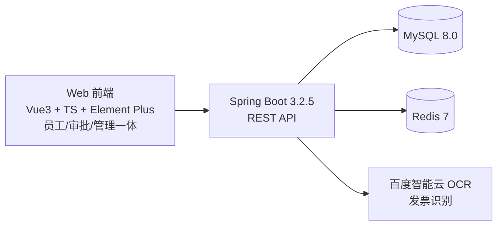
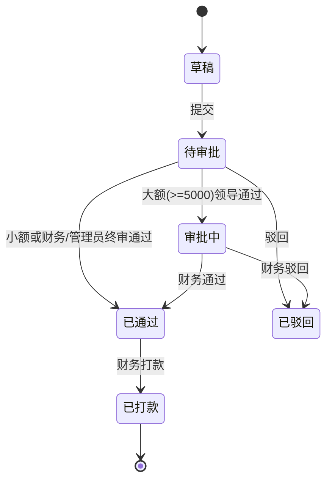

# 智报 - 智能差旅报销系统

> 企业差旅报销管理平台 | Spring Boot 3 + Vue 3 + TypeScript

[](https://spring.io/projects/spring-boot)
[](https://vuejs.org/)
[](https://sa-token.cc/)
[](LICENSE)

---

## 项目简介

面向企业员工的差旅报销管理系统，覆盖「出差申请 → 发票上传识别 → 报销单提交 → 多级审批 → 财务打款」全流程线上化，并提供数据报表与角色权限隔离。后端 Spring Boot + MyBatis-Plus，前端 Vue 3 + Element Plus，认证授权用 Sa-Token（JWT + Redis）。

### 核心功能

| 功能 | 说明 |
|------|------|
| **发票智能识别** | 上传发票图片 → 百度 OCR 识别 → 人工确认/修正 → 入库 |
| **报销审批** | 按金额分级审批，≥ 5000 元需两级审批，支持驳回重提 |
| **打款闭环** | 财务对「已通过」的报销单执行打款，状态流转 已通过 → 已打款 |
| **数据报表** | 报销总额 / 单数 / 审批通过率 / 平均金额 + 部门排行 + 费用类型分布，支持 CSV 导出 |
| **角色权限** | 员工 / 领导 / 财务 / 管理员 四级角色，数据范围隔离 |
| **出差申请** | 差旅申请的提交、审批流转 |
| **操作日志** | AOP 注解式记录关键操作（操作人 / IP / 耗时 / 结果），密码字段脱敏 |
| **消息通知** | 审批结果 / 打款进度自动推送站内通知，角标提醒未读数 |
| **异常预警** | 策略模式规则引擎（重复发票 / 日期异常 / 金额突增）每日定时扫描，财务/管理员处理闭环 |
| **Excel 导出** | 报销单按当前筛选条件一键导出 Excel（EasyExcel） |

### 用户角色与数据范围

| 角色 | 角色码 | 职责 | 数据可见范围 |
|------|--------|------|--------------|
| 员工 | 1 | 发起出差、上传发票、提交报销 | 仅自己 |
| 领导 | 2 | 审批本部门单据 | 本部门 |
| 财务 | 3 | 审批全部、执行打款、查看报表 | 全部 |
| 管理员 | 4 | 系统管理、全局报表、全部单据操作 | 全部 |

---

## 亮点设计

### 并发防护（三层递进）

| 场景 | 方案 | 兜底层 |
|------|------|--------|
| 提交防重复 | Redis SETNX 幂等标记（10s TTL，finally 释放） | 状态机校验（仅草稿/已驳回可提交） |
| 审批防双写 | Redis 分布式锁串行化（SETNX+EX、UUID 持有者、Lua 原子释放） | 状态校验（仅 1/2 可审批） |
| 打款防重 | Redis 分布式锁 | **数据库乐观更新** `WHERE status=3`，0 行即拦截 |

- **Redis 故障自动降级**：锁获取失败按成功处理（fail-open），由状态机/乐观锁兜底，业务永不因 Redis 中断
- **权限闭环**：任何角色都不能审批自己提交的单据（防自审自批）；发票详情、报销详情均有数据范围校验（员工看自己 / 领导看本部门 / 财务管理员看全部）
- 实现见 [RedisLock.java](server/src/main/java/com/smartexpense/redis/RedisLock.java) 与 [ReimbursementServiceImpl.java](server/src/main/java/com/smartexpense/service/impl/ReimbursementServiceImpl.java)

### 统计缓存

工作台/报表的聚合查询（十几条 GROUP BY/JOIN SQL）结果缓存到 Redis，5 分钟 TTL：

- key 含角色/用户/部门/日期范围（`stats:report:3:all:all:2026-08-01:2026-08-31`），不同数据范围互不串数据
- 缓存读/写/反序列化异常全部降级直查数据库，业务不中断
- 序列化复用 Spring ObjectMapper（jsr310），与接口 JSON 格式一致
- 实现见 [StatsCache.java](server/src/main/java/com/smartexpense/redis/StatsCache.java)

### 异常预警（策略模式规则引擎）

每天 9:00 定时扫描昨日数据（也可管理员手动触发），三条规则命中即生成预警记录，财务/管理员标记处理闭环：

| 规则 | 说明 |
|------|------|
| A001 重复发票 | 同一发票号出现在多个不同报销单中，疑似重复报销 |
| A002 发票日期异常 | 发票开票日期不在关联出差单的行程范围内 |
| A003 金额突增 | 本月已通过报销总额超过上月 150% |

- **策略模式**：每条规则一个实现类（[service/abnormal](server/src/main/java/com/smartexpense/service/abnormal/)），新增规则只需加类，符合开闭原则
- **单条规则失败不影响整体**：规则引擎逐个执行、异常隔离
- **去重防堆积**：同规则同业务（biz_key）只记录一次
- 实现见 [AbnormalRuleEngine.java](server/src/main/java/com/smartexpense/service/abnormal/AbnormalRuleEngine.java) 与 [AbnormalScanService.java](server/src/main/java/com/smartexpense/service/abnormal/AbnormalScanService.java)

### 工程细节

- **异步 OCR**：上传立即返回，专用线程池后台识别（CallerRunsPolicy 拒绝策略），前端轮询结果；增值税发票识别失败自动降级智能票据识别
- **导出完整性**：分页插件全局 maxLimit=100 防大查询，导出/审批中心循环分页取全量，杜绝静默截断
- **驳回可重提**：已驳回单据支持重新提交（报销直接重提、出差可修改后重提），历史审批记录保留
- **禁用即时生效**：禁用用户立即踢下线 + 角色查询状态校验双重保障

---

## 系统架构



---

## 技术栈

| 层级 | 技术 |
|------|------|
| 前端 | Vue 3.4 + TypeScript + Element Plus + Vite 5 + Pinia |
| 后端 | Spring Boot 3.2.5 + MyBatis-Plus 3.5.5 |
| 认证授权 | Sa-Token 1.37（JWT + Redis）|
| 数据库 | MySQL 8.0 |
| 缓存/锁 | Redis 7（会话 + 分布式锁 + 统计缓存）|
| OCR | 百度智能云 OCR |
| 接口文档 | SpringDoc OpenAPI（Swagger UI）|
| 工具 | Hutool、Lombok、EasyExcel |

---

## 快速开始

### 环境要求

- JDK 17+
- Node.js 18+
- Maven 3.8+
- MySQL 8.0、Redis 7（可用 Docker 一键启动）

### 一键启动（推荐，Windows）

```bat
scripts\start.bat
```

脚本按顺序做三件事：① 用 Docker 拉起 MySQL + Redis → ② 新窗口启动后端（`mvn spring-boot:run`）→ ③ 新窗口启动前端（`npm run dev`）。首次启动后端会自动建表、创建 4 个测试用户，并插入演示数据（6 条报销 + 5 条出差，覆盖各自全部状态），跑起来即可体验完整流程。Linux/macOS 可用 `scripts/start.sh`。

### 1. 启动基础设施

```bash
cd deploy
docker-compose up -d mysql redis
```

MySQL 映射到宿主机 `localhost:3307`，Redis 映射到 `localhost:6379`，与后端配置对齐。

### 2. 初始化数据库

MySQL 容器首次启动会自动执行 [server/src/main/resources/db/init.sql](server/src/main/resources/db/init.sql) 建表并插入部门数据。测试用户由后端 `DataInitializer` 在应用启动时自动创建。

### 3. 配置百度 OCR（可选，不配置则发票需人工录入）

OCR 密钥通过环境变量注入，**不写入代码、不提交 Git**：

```bash
export BAIDU_OCR_APP_ID=xxx
export BAIDU_OCR_API_KEY=xxx
export BAIDU_OCR_SECRET_KEY=xxx
```

本地开发也可写在 `server/src/main/resources/application-dev.yml`（该文件已被 `.gitignore` 忽略）。

### 4. 启动后端

```bash
cd server
mvn spring-boot:run
```

接口文档（Swagger）：http://localhost:8080/swagger-ui/index.html

### 5. 启动前端

前端（web-admin，员工/审批/报表/系统管理一体化，端口 3001）：

```bash
cd web-admin
npm install
npm run dev
```

访问：http://localhost:3001

### 测试账号

| 用户名 | 密码 | 角色 |
|--------|------|------|
| admin | 123456 | 管理员 |
| zhangsan | 123456 | 员工 |
| lisi | 123456 | 领导 |
| wangwu | 123456 | 财务 |

### 演示数据

后端首次启动（`DataInitializer`）会在表为空时自动插入演示数据，方便直接体验全流程：

- **报销单 6 条**：覆盖 0草稿 / 1待审批 / 2审批中（大额两级）/ 3已通过 / 4已驳回 / 5已打款（含打款人 + 打款时间）
- **出差申请 5 条**：覆盖 0草稿 / 1已提交 / 2审批中 / 3已通过 / 4已驳回
- 每条单据都带配套的发票与审批记录，登录即可看到各状态列表与详情

---

## 项目结构

```
smart-expense-reimbursement/
├── server/                          # Spring Boot 后端
│   ├── src/main/java/com/smartexpense/
│   │   ├── entity/                  # 数据实体
│   │   ├── mapper/                  # MyBatis Mapper
│   │   ├── service/                 # 业务层
│   │   ├── controller/              # REST 接口
│   │   ├── vo/                      # 视图对象
│   │   ├── config/                  # 配置类（Sa-Token、OCR、数据初始化等）
│   │   ├── common/                  # 通用类（Result、PageResult）
│   │   └── exception/               # 全局异常处理
│   ├── src/main/resources/
│   │   ├── application.yml          # 主配置
│   │   ├── application-dev.yml      # 本地密钥配置（gitignore）
│   │   └── db/init.sql              # 数据库初始化脚本
│   ├── src/test/java/               # 单元测试
│   └── pom.xml
├── web-admin/                       # Vue 3 前端（员工/审批/管理一体）
│   ├── src/
│   │   ├── api/                     # API 封装
│   │   ├── views/                   # 页面（工作台、出差、发票、报销、审批、报表、系统）
│   │   ├── layout/                  # 布局
│   │   ├── router/                  # 路由 + 角色守卫
│   │   ├── stores/                  # Pinia 状态
│   │   └── styles/                  # 样式
│   └── package.json
├── deploy/                          # 部署配置（docker-compose、nginx）
├── demo-invoices/                   # 发票 OCR 演示图片
└── docs/                            # 项目文档
```

---

## 核心接口

### 认证
| 接口 | 方法 | 说明 |
|------|------|------|
| `/user/login` | POST | 登录（用户名 + 密码），返回 token |
| `/user/register` | POST | 自助注册（默认员工角色） |
| `/user/logout` | POST | 登出 |

### 发票
| 接口 | 方法 | 说明 |
|------|------|------|
| `/invoice/upload` | POST | 上传发票图片，触发 OCR 识别 |
| `/invoice/confirm` | POST | 确认 / 修正识别结果 |
| `/invoice/list` | GET | 发票列表（分页 + 筛选） |

### 报销
| 接口 | 方法 | 说明 |
|------|------|------|
| `/reimbursement/create` | POST | 创建报销单（报销说明） |
| `/reimbursement/submit/{id}` | POST | 提交审批（发票金额自动汇总） |
| `/reimbursement/approve` | POST | 审批（通过 / 驳回，金额分级） |
| `/reimbursement/pay/{id}` | POST | 打款（财务 / 管理员，已通过 → 已打款） |
| `/reimbursement/list` | GET | 报销单列表（按角色数据范围过滤） |
| `/reimbursement/detail/{id}` | GET | 详情（含审批历史 + 发票明细） |
| `/reimbursement/export` | GET | 导出报销单 Excel（按当前筛选条件） |

### 出差申请
| 接口 | 方法 | 说明 |
|------|------|------|
| `/trip/create` | POST | 创建出差申请 |
| `/trip/submit` | POST | 提交审批 |
| `/trip/approve` | POST | 审批 |
| `/trip/list` | GET | 出差列表（按角色数据范围过滤） |

### 报表
| 接口 | 方法 | 说明 |
|------|------|------|
| `/report/stats` | GET | 汇总统计（总额/单数/通过率/平均/部门排行/费用类型） |

### 工作台
| 接口 | 方法 | 说明 |
|------|------|------|
| `/dashboard/stats` | GET | 工作台统计（按角色返回不同维度） |

### 操作日志
| 接口 | 方法 | 说明 |
|------|------|------|
| `/operlog/list` | GET | 操作日志列表（仅管理员，分页） |

### 消息通知
| 接口 | 方法 | 说明 |
|------|------|------|
| `/notice/list` | GET | 通知列表（当前用户，最近 50 条） |
| `/notice/unread` | GET | 未读通知数 |
| `/notice/read/{id}` | POST | 标记单条已读 |
| `/notice/read-all` | POST | 全部标记已读 |

---

## 状态机

### 报销单状态流转



### 报销单状态

| 状态码 | 含义 |
|--------|------|
| 0 | 草稿 |
| 1 | 待审批 |
| 2 | 审批中（大额，待二级审批）|
| 3 | 已通过 |
| 4 | 已驳回 |
| 5 | 已打款 |

### 出差申请状态

| 状态码 | 含义 |
|--------|------|
| 0 | 草稿 |
| 1 | 已提交 |
| 2 | 审批中 |
| 3 | 已通过 |
| 4 | 已驳回 |

> 金额单位统一为「元」（`DECIMAL(12,2)`）。审批记录写入 `approval_record` 表，保留完整审批轨迹。

---

## 数据库表

| 表名 | 说明 |
|------|------|
| sys_user | 用户表（username、password、role、dept_id） |
| sys_dept | 部门表（parent_id、dept_name、leader_id） |
| trip | 出差申请表（destination、purpose、budget_amount、status） |
| invoice | 发票表（amount、type、ocr_json、ocr_status） |
| reimbursement | 报销单表（total_amount、status、remark、pay_time） |
| approval_record | 审批记录表（action、comment、node_name） |
| sys_oper_log | 操作日志表（操作人、请求、结果、耗时） |
| sys_notice | 消息通知表（接收人、标题、内容、已读状态） |

---

## 环境变量

| 变量 | 说明 | 默认值 |
|------|------|--------|
| `BAIDU_OCR_APP_ID` | 百度 OCR 应用 ID | 空 |
| `BAIDU_OCR_API_KEY` | 百度 OCR API Key | 空 |
| `BAIDU_OCR_SECRET_KEY` | 百度 OCR Secret Key | 空 |

> 密钥仅通过环境变量或 `application-dev.yml`（已被 gitignore）注入，严禁提交到公开仓库。

---

## 项目文档

- [智能差旅报销系统_完整项目文档](docs/智能差旅报销系统_完整项目文档.md)
- [模块详细设计](docs/模块详细设计.md)
- [开发任务拆分](docs/开发任务拆分.md)
- [面试准备手册](docs/面试准备手册.md)

---

## 作者

蒋长红 · 软件技术专业 · 24届
